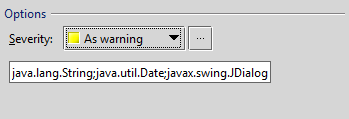

# 代码检查 Code Inspections

IntelliJ平台提供了专门用于静态代码分析的工具，称为代码检查，可帮助用户维护和清理代码而无需实际执行。 定制代码检查可以作为IntelliJ Platform插件实现。 插件方法的示例包括IntelliJ Platform SDK代码示例[inspection_basics](https://github.com/JetBrains/intellij-sdk-docs/tree/master/code_samples/inspection_basics)和[compareing_references_inspection](https://github.com/JetBrains/intellij-sdk-docs/tree/master/code_samples/comparing_references_inspection)。 此外，`comparing_references_inspection`代码示例演示了如何实现单元测试。

您还可以通过IntelliJ IDEA用户界面创建自定义检查。 有关更多信息，请参见[代码检查](https://www.jetbrains.com/idea/webhelp/code-inspection.html)和[创建自定义检查](https://www.jetbrains.com/idea/help/creating-custom-inspections.html)。

* [创建检查插件](#创建检查插件)
* [创建检查](#创建检查)
* [插件配置文件](#插件配置文件)
* [Inspection Implementation Java Class](#InspectionImplementationJavaClass)
* [Visitor Implementation Class](#VisitorImplementationClass)
* [Quick Fix Implementation](#QuickFixImplementation)
* [检查首选项面板](#检查首选项面板)
* [Inspection Description](#InspectionDescription)
* [Inspection Unit Test](#InspectionUnitTest)
* [Running the Comparing References Inspection Code Sample](#RunningtheComparingReferencesInspectionCodeSample)
* [参考文献](#参考文献)

## <a name="创建检查插件">创建检查插件</a>

`compare_references_inspection` 代码示例向Java添加了新的检查。 “检查”列表中的“可能的错误”组。检查在引用类型的Java表达式之间使用 `==` 或 `!=` 运算符时报告。它说明了自定义检查插件的组件：

* 在插件配置文件中描述 `inspection`。
* 在基于IntelliJ平台的IDE编辑器中实现 [local inspection class](https://jetbrains.org/intellij/sdk/docs/tutorials/code_inspections.html#inspection-implementation-java-class) 以检查Java代码。
* 创建一个 `visitor` 以遍历正在编辑的Java文件的 `PsiTree`，检查语法是否有问题。
* 通过根据需要更改 `PsiTree` 来实现快速修复类以纠正语法问题。 快速修复会像意图一样向用户显示。
* 实现检查首选项面板以显示有关检查的信息。
* 编写检查的HTML描述以在“检查首选项”面板中显示。
* 为插件创建单元测试（可选）。

尽管IntelliJ Platform SDK代码示例说明了这些组件的实现，但查看 `intellij_community` 代码库中实现的检查示例通常会很有用。 此过程可以帮助您根据IDE UI中可见的内容查找检查描述和实现。 整体方法也适用于针对其他语言的检查。

* 在`“Preferences | Editor | Inspections”`中找到与您要实施的检查类似的现有检查。注意检查的显示名称。 例如，`Java/Probable Bugs` 检查“`使用'=='而不是'equals()'进行对象比较`”与 `compare_references_inspection` 非常相似。
* 使用显示名称文本作为 `intellij_community` 项目中搜索的目标。 如果显示名称已本地化，这将标识捆绑文件。 如果未本地化，则搜索会找到插件配置（plugin.xml）文件（该文件是检查描述中的属性），或者找到Java配置文件（该文件由重写方法提供）。
* 在本地化的情况下，从搜索确定的捆绑文件中复制 `key`。
  * 使用 `key` 文本作为 `intellij_community` 项目中搜索的目标。 该搜索找到描述检查的插件配置文件。
  * 在检查描述 `entry` 中，找到 `ImplementationClass` 属性值。
* 使用 `implementationClass` 文本作为 `intellij_community` 代码库中的类搜索的目标，以查找Java实现文件。

## <a name="创建检查">创建检查</a>

`compare_references_inspection` 代码示例在**引用类型的Java表达式之间使用 == 或 != 运算符时**的情况报警。 用户可以应用快速修复程序将 `a == b` 更改为 `a.equals(b)`，或将 `a!= b` 更改为 `!a.equals(b)`。

`compare_references_inspection` 实现的详细信息说明了检查插件的组件。

## <a name="插件配置文件">插件配置文件</a>

`compareing_references_inspection` 被描述为 `compareing_references_inspection` 插件配置（plugin.xml）文件中 `<extensions>` 元素内的 `<localInspection>` 类型。在底层，检查类型在 `LangExtensionPoints.xml` 中描述为 `<extensionPoint>`

* `localInspection` 类型用于一次检查一个文件的检查，并在用户编辑文件时进行操作。
* `globalInspection` 类型用于跨多个文件进行的检查，例如，关联的修复程序可能会在文件之间重构代码。
* 不建议使用 `inspectToolProvider` 类型，但首选 `localInspection`。

最小检查描述必须包含 `ImplementationClass` 属性。 如 `compareing_references_inspection` 插件配置文件中所示，可以在 `localInspection` 元素中定义其他属性（带或不带本地化）。 在大多数情况下，最简单的方法是在插件配置文件中定义属性，因为基础父类根据配置文件描述处理大多数类职责。 请注意，某些属性不会显示给用户，因此它们永远不会被本地化。

或者，检查可以通过覆盖检查实现类中的方法来定义所有属性信息（`implementationClass`除外）。

## <a name="InspectionImplementationJavaClass">Inspection Implementation Java Class</a>

Java文件的检查实现（例如 `ComparingReferencesInspection`）通常基于Java类 `AbstractBaseJavaLocalInspectionTool`。 `AbstractBaseJavaLocalInspectionTool` 实现类提供检查Java类，字段和方法的方法。

一般而言，`localInspection` 类型基于 `LocalInspectionTool` 类。 检查 `LocalInspectionTool` 的类层次结构表明，IntelliJ平台为多种语言和框架提供了许多子检查类。这些类是新检查实现的良好基础，但是定制实现也可以直接基于 `LocalInspectionTool`。

检查实现类的主要职责是提供：

* 一个 `PsiElementVisitor` 对象，用于遍历要检查的文件的 `PsiTree`。
* `LocalQuickFix` 类，用于更改已识别问题的语法。
* 将在“`Inspections`”对话框中显示的JPanel。

> 请注意，如果插件配置文件中检查的描述仅定义了实现类，则必须通过Java实现中的重写方法来提供其他属性信息。

`ComparingReferencesInspection` 类定义两个String字段：

* `QUICK_FIX_NAME` 定义了用户在提示应用快速修复时看到的字符串。
* `CHECKED_CLASSES` 包含检查所需的类名称列表。

## <a name="VisitorImplementationClass">Visitor Implementation Class</a>

visitor类评估文件PsiTree的元素是否值得检查。

`ComparingReferencesInspection.buildVisitor()` 方法基于 `JavaElementVisitor` 创建一个匿名访问者类，以遍历正在编辑的Java文件的 `PsiTree`，检查可疑语法。 匿名类`overrides`了三个方法：

* `visitReferenceExpression()` 防止reference-type表达式的任何重复访问。
* `visitBinaryExpression()` ，完成所有繁重的工作。 调用它来评估 `PsiBinaryExpression`，并检查操作数是 `==` 还是 `!=`，以及操作数是否是与此检查相关的类。
* `isCheckedType()` 评估操作数的 `PsiType` 以确定此检查是否感兴趣。

## <a name="QuickFixImplementation">Quick Fix Implementation</a>

快速修复类的行为很像意图(intention)，它允许用户更改检查中突出显示的 `PsiTree` 部分。 当检查突出显示感兴趣的 `PsiElement` 并且用户选择进行更改时，将调用快速修复。

`ComparingReferencesInspection` 实现使用嵌套类 `CriQuickFix` 来实现基于 `LocalQuickFix` 的快速修复。 `CriQuickFix` 类使用户可以选择将 `a == b` 和 `!= b` 表达式的用法分别更改为 `a.equals(b)` 和 `!a.equals(b)`。

繁重的工作在 `CriQuickFix.applyFix()` 中完成，该操作操纵 `PsiTree` 转换表达式。 对 `PsiTree` 的更改是通过通常的修改方法完成的：

* 获取一个 `PsiElementFactory`。
* 创建一个新的 `PsiMethodCallExpression`。
* 将原始的左右操作数替换为新的 `PsiMethodCallExpression`。
* 用 `PsiMethodCallExpression` 替换原始的二进制表达式。

## <a name="检查首选项面板">检查首选项面板</a>

检查首选项面板用于显示有关检查的信息。

由 `ComparingReferencesInspection.createOptionsPanel()` 创建的面板仅定义了一个 `JTextField` 以显示在JPanel中。 当选择了 `compareing_references_inspection` 短名称时，此JPanel将被添加到默认的 `IntelliJ Platform Inspections Preferences` 对话框中。 `JTextField` 允许在面板中显示时编辑 `CHECKED_CLASSES` 字段。

请注意，IntelliJ平台提供了“**检查首选项**”面板中显示的大部分UI。 只要正确定义了**检查属性和检查描述**，IntelliJ平台就会在“**检查首选项**” UI中显示信息。

## <a name="InspectionDescription">Inspection Description</a>

Inspection Description 是一个HTML文件。 从列表中选择检查后，`Description` 将显示在“检查首选项”对话框的右上方面板中。

在检查实现的类层次结构中隐式使用 `LocalInspectionTool` 意味着遵循一些约定。

* inspection description 文件应位于 `<plugin root dir>/resources/inspectionDescriptions/` 下。如果检查描述文件位于其他位置，请在检查实现类中重写 `getDescriptionUrl()`。
* description 文件的名称 `<short name>.html` 应为检查描述或检查实现类提供的检查short name。如果插件未提供短名称，则IntelliJ平台将计算一个。

## <a name="InspectionUnitTest">Inspection Unit Test</a>

`compare_references_inspection` 代码示例为检查提供了单元测试。有关插件测试的一般信息，请参见[“测试插件”](https://jetbrains.org/intellij/sdk/docs/basics/testing_plugins/testing_plugins.html)部分。

`compare_references_inspection` 测试基于JUnit框架API的一部分 `UtilityUseCase` 类。此类处理许多底层的样板测试。

按照惯例，文件夹 `<project root>/testSource/testPlugin/` 包含测试源代码，必须将其标记为“`Tests`”文件夹。如果不是，则DevKit项目无法找到源代码。

按照惯例，文件夹 `<project root>/testData/` 包含测试文件，并且必须标记为“`Test Resources`”文件夹。该文件夹包含使用名称约定 `*.java` 和 `*.after.java` 的每个测试的文件对。

在 `compare_references_inspection` 测试用例中，测试文件为 `before.java` 和 `before.after.java`，以及 `before1.java` 和 `before1.after.java`。before和before1的选择是任意的。

`compare_references_inspection`测试对 `*.java` 文件运行检查，实施快速修复，并将结果与​​相应的 `*.after.java` 文件进行比较。

## <a name="RunningtheComparingReferencesInspectionCodeSample">Running the Comparing References Inspection Code Sample</a>

`compare_references_inspection` 代码示例向 `Java | Probable Bugs` （“检查”列表中的“可能的错误”组）添加了新的检查。 检查在引用类型的Java表达式之间使用 `==` 或 `!=` 运算符时报警。

运行示例插件：

* 启动IntelliJ IDEA，打开 `intellij-sdk-docs` 项目，并突出显示 `compareing_references_inspection` 模块。
* 打开“项目结构”对话框，并确保项目设置对您的环境有效。
* 如有必要，请修改 `compare_references_inspection` 模块的“运行/调试配置”。
* 通过在主菜单上选择“运行”来运行插件。

### Configuring the Plugin

启动插件后，您可以设置插件选项。 您可以指定Java类以参与代码检查以及发现的可能错误的严重性级别。

在IDEA主菜单上，打开 `“Preferences | Editor | Inspections”` 对话框。 在 `IntelliJ IDEA Java` 检查的列表中，展开“`Probable bugs`”节点，然后单击 `SDK: ‘==’ or ‘!=’ instead of ‘equals()’`。



在选项下，您可以指定以下插件设置：

* 从“`严重性 - Severity`”列表中，选择插件发现的可能错误的严重性级别，例如“警告 - Warning”，“信息 - Info”等。
* 在“`严重性 - Severity`”下的文本框中，指定用分号分隔的Java类列表以参与此代码检查。
* 完成后，单击“确定”。

### How does it work?

该插件检查您在IntelliJ IDEA编辑器中打开的代码或您键入的代码。该插件突出显示了代码片段，其中引用类型的两个变量用 `==` 或 `!=` 分隔，并建议用 `.equals()` 替换此代码片段：


在此示例中，str1和str2是String类型的变量。 单击 SDK: Use equals() 替换：
```java
return (str1==str2);
```
with the code:
```java
return (str1.equals(str2));
```

## <a name="参考文献">参考文献</a>

[Code Inspections](https://jetbrains.org/intellij/sdk/docs/tutorials/code_inspections.html)
