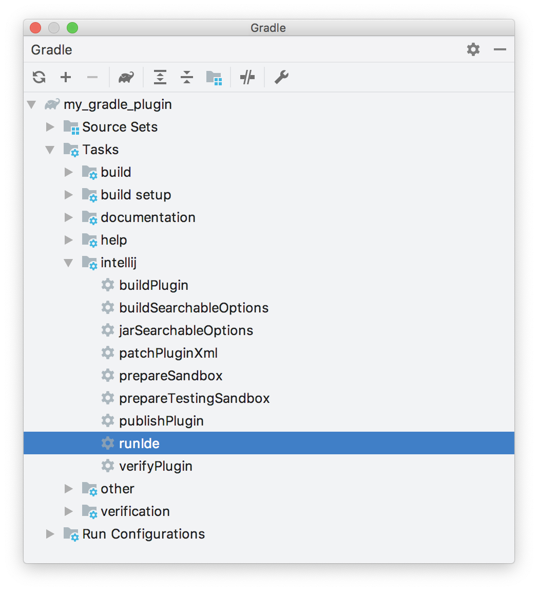

# Building Plugins with Gradle

* [简介](#简介)
* [Getting Started with Gradle](#GettingStartedwithGradle)
  * [Creating a Gradle-Based IntelliJ Platform Plugin with New Project Wizard](#CreatingGradleBasedIntelliJPlatformPluginwithNewProjectWizard)
  * [向现有的基于DevKit的IntelliJ平台插件添加Gradle支持](#向现有的基于DevKit的IntelliJ平台插件添加Gradle支持)
  * [运行基于简单Gradle的IntelliJ平台插件](#运行基于简单Gradle的IntelliJ平台插件)
* [Configuring Gradle Projects](#ConfiguringGradleProjects)
* [参考文献](#参考文献)

## <a name="简介">简介</a>
`gradle-intellij-plugin` Gradle插件是构建IntelliJ插件的推荐解决方案。插件负责插件项目的依赖项-基本IDE和其他插件依赖项。

`gradle-intellij-plugin`提供了一些tasks，可通过您的插件运行IDE并将您的插件发布到JetBrains插件存储库。 为确保您的插件不受平台主要版本之间可能发生的API更改的影响，您可以轻松地针对多种版本的基本IDE构建您的插件。

> 在将其他存储库添加到Gradle构建脚本时，请确保始终使用HTTPS协议。

请确保始终升级到`gradle-intellij-plugin`的最新版本。 关注[GitHub](https://github.com/JetBrains/gradle-intellij-plugin/releases)上的发布。

## <a name="GettingStartedwithGradle">Getting Started with Gradle</a>

`Gradle`是用于创建`IntelliJ Platform`插件的首选解决方案。 IntelliJ IDEA Ultimate和Community版本捆绑了必要的插件以支持基于Gradle的开发。 这些`IntelliJ IDEA`插件是`Gradle`和`Plugin DevKit`，默认情况下启用。

### <a name="CreatingGradleBasedIntelliJPlatformPluginwithNewProjectWizard">Creating a Gradle-Based IntelliJ Platform Plugin with New Project Wizard</a>

使用“**新建项目向导**”执行基于`Gradle`的新`IntelliJ Platform`插件项目的创建。 该向导根据一些模板输入创建所有必要的项目文件。

> **请注意**，Gradle 6.1有一个已知的[bug](https://github.com/gradle/gradle/issues/11966)，阻止它用于开发插件，请升级到6.1.1或更高版本。

启动[New Project Wizard](https://www.jetbrains.com/help/idea/gradle.html#project_create_gradle)。 它通过两个屏幕指导您完成Gradle项目的创建过程。

#### New Project Configuration Screen

在第一个screen上，配置项目类型：

* 在左侧的项目类型窗格中，选择`Gradle`。
* 指定基于Java 8 JDK的`Project SDK`。 该SDK将是用于运行Gradle的默认JRE，并且是用于编译插件Java源代码的JDK版本。
* 在“`Additional Libraries and Frameworks`”面板中，选择“`Java`和`IntelliJ Platform Plugin`”。 这些设置将在本教程的其余部分中使用。

可选地：

* 要在插件中包含对Kotlin语言的支持，请选中`Kotlin/JVM`框（下面的绿色圆圈）。可以使用或不使用Java语言来选择此选项。 有关更多信息，请参见[Kotlin for Plugin Developers](https://jetbrains.org/intellij/sdk/docs/tutorials/kotlin.html)。
* 要将`build.gradle`文件创建为`Kotlin`构建脚本（`build.gradle.kts`）而不是`Groovy`，请选中`Kotlin DSL build script`框（在下面的洋红色圆圈中）。

Then click Next:


#### Project Naming/Artifact Coordinates Screen

展开“`Artifact Coordinates`”部分，并使用Maven命名约定指定`GroupId`，`ArtifactId`和`Version`。

* `GroupId`通常是Java程序包名称，用于项目的`build.gradle`文件中的Gradle属性`project.group`值。 对于此示例，输入com.your.company。
* `ArtifactId`是项目JAR文件的默认名称（无版本）。 它也用于项目的`settings.gradle`文件中的Gradle属性`rootProject.name`值。 对于此示例，输入my_gradle_plugin。
* 版本用于`build.gradle`文件中的Gradle属性`project.version`值。 对于此示例，输入1.0。

“`Name`”字段将与指定的`ArtifactId`自动同步。

在“`Location`”中指定新项目的路径，然后单击“完成”以继续并生成项目。

#### Components of a Wizard-Generated Gradle IntelliJ Platform Plugin

For the example my_gradle_plugin, the New Project Wizard creates the following directory content:

```
my_gradle_plugin
├── build.gradle
├── gradle
│   └── wrapper
│       ├── gradle-wrapper.jar
│       └── gradle-wrapper.properties
├── gradlew
├── gradlew.bat
├── settings.gradle
└── src
    ├── main
    │   ├── java
    │   └── resources
    │       └── META-INF
    │           └── plugin.xml
    └── test
        ├── java
        └── resources
```

* 默认的IntelliJ Platform `build.gradle`文件。
* `Gradle Wrapper`文件，尤其是`gradle-wrapper.properties`文件，该文件指定了用于构建插件的Gradle版本。 如果需要，`IntelliJ IDEA Gradle`插件将下载此文件中指定的Gradle版本。
* `settings.gradle`文件，其中包含`rootProject.name`的定义。
* 默认主`SourceSet`下的`META-INF`目录包含插件配置文件。

The generated `my_gradle_plugin` project `build.gradle` file:

```groovy
plugins {
    id 'java'
    id 'org.jetbrains.intellij' version '0.4.21'
}

group 'com.your.company'
version '1.0' 
sourceCompatibility = 1.8

repositories {
    mavenCentral()
} 
dependencies {
    testImplementation group: 'junit', name: 'junit', version: '4.12'
}

// See https://github.com/JetBrains/gradle-intellij-plugin/
intellij {
    version '2020.1'
}
patchPluginXml {
    changeNotes """
      Add change notes here.<br>
      <em>most HTML tags may be used</em>"""
}
```

* 显式声明了Gradle的两个插件：
  * Gradle `Java`插件。
  * `gradle-intellij-plugin`。
* Project Naming/Artifact Coordinates Screen中的**GroupId**是`project.group`值。
* Project Naming/Artifact Coordinates Screen中的**Version**是`project.version`值。
* 注入`sourceCompatibility`行以使用Java 8 JDK强制编译Java源代码。
* 该文件中唯一的注释是`gradle-intellij-plugin`的README.md链接，该链接是其配置DSL的参考。
* 设置DSL属性`intellij.version`的值指定用于构建插件的**IntelliJ平台的版本**。 它默认为用于运行“新建项目向导”的IntelliJ IDEA版本。
* Patching DSL属性`patchPluginXml.changeNotes`的值设置为占位符文本。


#### 插件Gradle属性和插件配置文件元素

通常，Gradle属性`rootProject.name`和`project.group`不会与相应的插件配置文件`plugin.xml`元素`<name>`和`<id>`匹配。 由于它们具有不同的功能，因此没有与IntelliJ平台相关的原因。

* `<name>`元素（用作插件的显示名称）通常与`rootProject.name`相同，但更具解释性。
* `<id>`值必须是所有插件上的唯一标识符，通常是指定的`GroupId`和`ArtifactId`的串联。 

> 请注意，在不丢失现有安装的自动更新的情况下，更改已发布插件的<id>是不可能的。

### <a name="向现有的基于DevKit的IntelliJ平台插件添加Gradle支持">向现有的基于DevKit的IntelliJ平台插件添加Gradle支持</a>

可以使用“New Project Wizard”将基于DevKit的插件项目转换为基于Gradle的插件项目，以围绕现有的基于DevKit的项目创建基于Gradle的项目：

* 确保如有必要，可以完全恢复包含基于DevKit的IntelliJ Platform插件项目的目录。
* 删除基于DevKit的项目的所有artifacts：
  * `.idea`目录
  * `[modulename].iml` 文件
  * `out` 目录
* 将现有的源文件以`Gradle SourceSet`格式排列在项目目录中。
* 使用“`New Project Wizard`”，就像从头开始创建新的Gradle项目一样。
* 在`Project Naming/Artifact Coordinates Screen` 上，将值设置为：
  * `GroupId`现有插件的源码集的包名。
  * `ArtifactId`为现有插件的名称。
  * `Version`与现有插件相同。
  * `Name`为现有插件的名称。 （应从ArtifactId中预先填写）
  * 将`Location`设置为现有插件的目录。
* 单击完成以创建新的基于Gradle的插件。
* 根据需要使用Gradle `Source Set`添加更多模块。

### <a name="运行基于简单Gradle的IntelliJ平台插件">运行基于简单Gradle的IntelliJ平台插件</a>

从IDE的`Gradle Tool window`运行Gradle项目。

#### Adding Code to the Project

在运行my_gradle_project之前，可以添加一些代码以提供简单的功能。

#### Executing the Plugin

打开`Gradle Tool window`并搜索`runIde`任务：

* 如果不在列表中，请点击Gradle窗口顶部的Refresh按钮。
* 或创建一个新的Gradle运行配置。



双击`runIde`任务以执行它。 有关[使用Gradle任务](https://www.jetbrains.com/help/idea/gradle.html#96bba6c3)的更多信息，请参见IntelliJ IDEA帮助。

最后，在IDE开发实例中启动`my_gradle_plugin`时，“工具”菜单下应有一个新菜单。

## <a name="ConfiguringGradleProjects">Configuring Gradle Projects</a>


## <a name="参考文献">参考文献</a>

[Building Plugins with Gradle](https://jetbrains.org/intellij/sdk/docs/tutorials/build_system.html)

[intellij-platform-plugin-template](https://github.com/JetBrains/intellij-platform-plugin-template)

[Plugin for building plugins for IntelliJ IDEs](https://plugins.gradle.org/plugin/org.jetbrains.intellij#groovy-usage)

[https://github.com/JetBrains/gradle-intellij-plugin](https://github.com/JetBrains/gradle-intellij-plugin)
